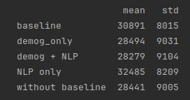
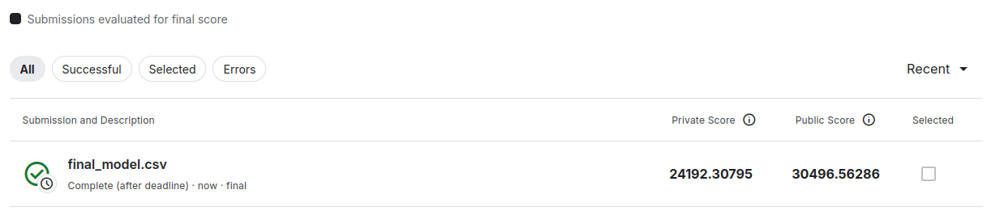

# Kaggle Competition — Actuarial Loss Estimation

Lien de la compétition :  
:https://www.kaggle.com/competitions/actuarial-loss-estimation/overview

---

## Objectif

L’objectif de cette compétition est de prédire le coût final des sinistres de type *Workers' Compensation* (`UltimateIncurredClaimCost`) à partir de données synthétiques réalistes issues du domaine de l’assurance.

---


## Installation

Cloner le repo et installer les dépendances :

```bash
git clone git@github.com:Tiphainell/actuariat_worker_compensation.git
cd actuariat_worker_compensation
python3 -m venv .venv
source .venv/bin/activate
pip install .
```
## Configuration

Spécifier le chemin vers les données dans le fichier config.py :

```Python
DATA_PATH = "/chemin/vers/les/donnees"
```

# Structure du projet

```
kaggle_actuariat/
│
├── Notebooks/                    # Exploratory analysis and experiments
│   ├── Exploration_data.ipynb
│   ├── Exploration_NLP.ipynb
│   └── Ablation_Study.ipynb
│
├── src/
│   ├── submission_pipeline.py   # Training + inference pipeline for Kaggle submission
    ├── cv_model.py              # Function with the model and cross-validation experiment for the ablation study
│   │
│   └── utils/
│       ├── data_processing.py    # Feature engineering - Demographic features
│       └── nlp_processing.py     # NLP preprocessing and NLP features
│
├── resultats/                    # Generated Kaggle submissions
│
├── README.md
└── pyproject.toml
└── config.py

```

# Actuarial Loss Estimation — Kaggle Competition

## 1. Contexte

Ce projet s’inscrit dans une problématique de tarification en assurance non-vie : la prédiction du coût final de sinistres (*Workers’ Compensation*) à partir de données assurantielles réalistes et partiellement synthétiques.

L’enjeu principal est de modéliser une variable fortement bruitée (données synthétiques) et asymétrique, caractérisée par :
- une forte dispersion des montants de sinistres,
- une distribution à queue lourde,
- des effets temporels potentiels (inflation),
- et une forte dépendance à des variables métier.

---

## 2. Données

Le jeu de données contient environ 90 000 observations :
- 54 000 observations d’entraînement
- 36 000 observations de test

Variable cible :
`UltimateIncurredClaimCost`

La métrique d’évaluation est le RMSE, pénalisant fortement les erreurs sur les sinistres extrêmes, ce qui est cohérent avec un contexte assurantiel.

---

## 3. Problématique et enjeux métier

Le problème présente plusieurs enjeux structurants :

- **Gestion des outliers** : forte asymétrie des montants de sinistres
- **Temporalité implicite** : effets d’inflation potentiels à intégrer
- **Information hétérogène** : mélange de variables numériques, catégorielles et textuelles
- **Signal faible dans le texte** : contribution incertaine des descriptions de sinistres

---

## 4. Approche méthodologique

### 4.1 Transformation de la variable cible

Afin de stabiliser la variance et limiter l’impact des valeurs extrêmes :
- application de `log1p` sur la target à l’entraînement
- retransformation via `expm1` lors de l’inférence

---

### 4.2 Feature Engineering

Deux familles de variables ont été construites.

#### a) Variables démographiques et métier

Ces features visent à capturer des effets structurels et temporels :

- composantes temporelles (année, mois, semaine, heure) de la date d'accident
- délai de déclaration du sinistre
- indicateurs liés aux salaires
- ratios métier (ex : salaire / durée de travail)
- transformations non linéaires (ex : âge²)

Objectif : capturer des effets d’inflation, de temporalité et de non-linéarité.

---

#### b) Features NLP

Les variables textuelles issues de `ClaimDescription` sont traitées pour refléter la gravité de l'accident (librairie NLTK).

Elles permettent d’extraire :
- type de blessure
- partie du corps concernée
- latéralité
- présence de stress

Approche volontairement interprétable afin de tester la valeur ajoutée du signal textuel dans un cadre tabulaire.

---

## 5. Modélisation

Le modèle retenu est **XGBoost**, particulièrement adapté ici car le problème peut être vu comme une correction résiduelle de `InitialIncurredClaimsCost`.

Le modèle a également été choisi pour :
- sa robustesse sur données tabulaires hétérogènes,
- sa capacité à capturer des non-linéarités,
- son aptitude à modéliser des interactions complexes,
- sa performance sur des distributions non gaussiennes.

---

## 6. Protocole expérimental

### 6.1 Baseline

- `UltimateClaim = InitialClaim`

### 6.2 Jeux de features testés

- features démographiques uniquement
- features démographiques + NLP
- NLP uniquement
- démographie + NLP sans `InitialIncurredClaimsCost`

### 6.3 Validation

Validation croisée à 5 folds sur RMSE.

---

## 7. Résultats

### Observations principales


- Le modèle basé uniquement sur les features démographiques atteint une RMSE moyenne de **28 484** sur les folds, contre **30 891** pour la baseline seule. Dans cette configuration, la variable `InitialIncurredClaimsCost` apparaît comme une variable fortement explicative.

- L’ajout des features NLP améliore marginalement la performance, avec une réduction de RMSE d’environ **215 points**, mais s’accompagne d’une augmentation de la variance d’environ **70 points**. Dans ce cadre, la feature `InitialIncurredClaimsCost` est moins explicative.

- Les features NLP utilisées seules ne permettent pas de capturer la structure du problème (RMSE moyenne de **32 485**).

- Enfin, le modèle combinant features démographiques et NLP, sans inclure la variable fortement prédictive `InitialIncurredClaimsCost`, atteint une performance comparable au modèle démographique seul (**RMSE 28 441**). Ce résultat suggère que les features construites permettent de répliquer en partie l’information portée par cette variable, tout en améliorant légèrement la robustesse du modèle par rapport à la baseline.


```
Résultats dans le notebook Ablation_study.ipynb
``` 

### Conclusion expérimentale

Le meilleur compromis performance / complexité est obtenu avec un modèle basé uniquement sur les variables démographiques qui a finalement été choisi pour la soumission.

---

## 8. Pipeline de soumission

La génération de la soumission est automatisée via :

```bash
python submission_pipeline.py
```

Résultats obtenus sur le leaderboard (RMSE 24 192 sur le test privé, 30 496 test public) : 

!

La meilleure performance sur le leaderboard est 23 355 privé, 29 725 sur le test public.

## Limites et pistes d’amélioration:

Plusieurs pistes d’amélioration restent possibles :

Le NLP utilisé repose sur des règles métier simples.
Des approches plus avancées pourraient être explorées :
* embeddings,
* transformers,
* modèles pré-entraînés.

Le modèle étant interprétable, une analyse des variables importantes via SHAP values pourrait être réalisée et mise au propre.
Les gains en performance des différents modèles pourraient être évalués avec des tests statistiques pour documenter le choix des modèles.

Les performances pourraient être améliorées via :
* une meilleure gestion des outliers ;
* une optimisation plus poussée des hyperparamètres ;
* des features métier supplémentaires.