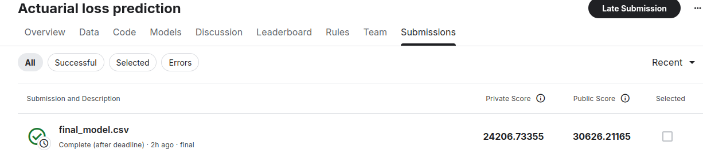

# Kaggle Competition — Actuarial Loss Estimation

Lien de la compétition :  
:contentReference[oaicite:0]{index=0}

---

## Objectif

L’objectif de cette compétition est de prédire le coût final des sinistres de type *Workers' Compensation* (`UltimateIncurredClaimCost`) à partir de données synthétiques réalistes issues du domaine de l’assurance.

Le problème présente plusieurs défis importants :
- une forte variabilité des montants de sinistres ;
- la présence d’outliers et de distributions asymétriques ;
- des effets temporels potentiellement liés à l’inflation.

Le projet combine :
- des variables démographiques et métier ;
- du feature engineering temporel ;
- ainsi que des features NLP simples extraites des descriptions textuelles des sinistres.

---

## Données

Le dataset contient environ **90 000 observations** :
- **54 000 lignes d’entraînement**
- **36 000 lignes de test**

La variable cible est :

```text
UltimateIncurredClaimCost
```

## Installation

Cloner le repo et installer les dépendances :

```bash
git git@github.com:Tiphainell/actuariat_worker_compensation.git
cd actuariat_worker_compensation
python3 -m venv .venv
source .venv/bin/activate
pip install .
```
# Structure du projet

```
kaggle_actuariat/
│
├── Notebooks/                    # Exploratory analysis and experiments
│   ├── Exploration_data.ipynb
│   ├── Exploration_NLP.ipynb
│   └── Ablation_Study.ipynb
│
├── src/
│   ├── submission_pipeline.py    # Training + inference pipeline
    ├──  cv_model.py              # Function for cross-validation for the ablation study
│   │
│   └── utils/
│       ├── data_processing.py    # Feature engineering
│       └── nlp_processing.py     # NLP preprocessing and NLP features
│
├── resultats/                    # Generated Kaggle submissions
│
├── README.md
└── pyproject.toml

```

# Actuarial Loss Estimation — Kaggle Competition

## 1. Contexte

Ce projet s’inscrit dans une problématique de tarification en assurance non-vie : la prédiction du coût final de sinistres (*Workers’ Compensation*) à partir de données assurantielles réalistes et partiellement synthétiques.

L’enjeu principal est de modéliser une variable fortement bruitée et asymétrique, caractérisée par :
- une forte dispersion des montants de sinistres,
- une distribution à queue lourde,
- des effets temporels potentiels (inflation),
- et une forte dépendance à des variables métier.

---

## 2. Données

Le jeu de données contient environ 90 000 observations :
- 54 000 observations d’entraînement
- 36 000 observations de test

Variable cible :
`UltimateIncurredClaimCost`

La métrique d’évaluation est le RMSE, pénalisant fortement les erreurs sur les sinistres extrêmes, ce qui est cohérent avec un contexte assurantiel.

---

## 3. Problématique et enjeux métier

Le problème présente plusieurs enjeux structurants :

- **Gestion des outliers** : forte asymétrie des montants de sinistres
- **Temporalité implicite** : effets d’inflation potentiels à intégrer
- **Information hétérogène** : mélange de variables numériques, catégorielles et textuelles
- **Signal faible dans le texte** : contribution incertaine des descriptions de sinistres

---

## 4. Approche méthodologique

### 4.1 Transformation de la variable cible

Afin de stabiliser la variance et limiter l’impact des valeurs extrêmes :
- application de `log1p` sur la target à l’entraînement
- retransformation via `expm1` lors de l’inférence

---

### 4.2 Feature Engineering

Deux familles de variables ont été construites.

#### a) Variables démographiques et métier

Ces features visent à capturer des effets structurels et temporels :

- composantes temporelles (année, mois, semaine, heure)
- délai de déclaration du sinistre
- indicateurs liés aux salaires
- ratios métier (ex : salaire / durée de travail)
- transformations non linéaires (ex : âge²)

Objectif : capturer des effets d’inflation, de temporalité et de non-linéarité.

---

#### b) Features NLP

Les variables textuelles issues de `ClaimDescription` sont traitées via une approche heuristique (NLTK).

Elles permettent d’extraire :
- type de blessure
- partie du corps concernée
- latéralité
- présence de stress

Approche volontairement interprétable afin de tester la valeur ajoutée du signal textuel dans un cadre tabulaire.

---

## 5. Modélisation

Le modèle retenu est **XGBoost (gradient boosting sur arbres de décision)**.

Ce choix est motivé par :
- sa robustesse sur données tabulaires hétérogènes,
- sa capacité à capturer des non-linéarités,
- son aptitude à modéliser des interactions complexes,
- sa performance sur des distributions non gaussiennes.

---

## 6. Protocole expérimental

### 6.1 Baseline

- `UltimateClaim = InitialClaim`

### 6.2 Jeux de features testés

- features démographiques uniquement
- features démographiques + NLP
- NLP uniquement
- démographie + NLP sans `InitialIncurredClaimsCost`

### 6.3 Validation

Validation croisée à 5 folds sur RMSE.

---

## 7. Résultats

### Observations principales

- Les features démographiques et métier constituent le principal signal prédictif.
- L’ajout des features NLP n’apporte pas d’amélioration significative du RMSE.
- Les features NLP seules sont insuffisantes pour capturer la structure du problème.
- La variable `InitialIncurredClaimsCost` est un prédicteur fortement dominant.


### Conclusion expérimentale

Le meilleur compromis performance / complexité est obtenu avec un modèle basé uniquement sur les variables démographiques et métier.

---

## 8. Pipeline de soumission

La génération de la soumission est automatisée via :

```bash
python submission_pipeline.py
```

Résultats obtenus sur le leaderboard : 


Limites et pistes d’amélioration:

Plusieurs pistes d’amélioration restent possibles :

Le NLP utilisé repose sur des règles métier simples.
Des approches plus avancées pourraient être explorées :
* embeddings,
* transformers,
* modèles pré-entraînés.
Le modèle étant interprétable, une analyse des variables importantes via SHAP values pourrait être réalisée.
Les performances pourraient être améliorées via :
* une meilleure gestion des outliers ;
* une optimisation plus poussée des hyperparamètres ;
* des features métier supplémentaires.